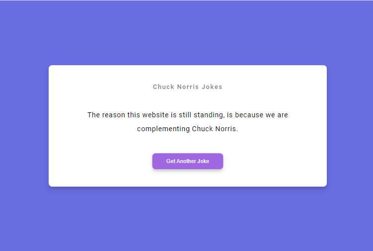

# Joke Generetor

XHR = XMLHttpRequest Object

## How It's Made:

**Tech used:** HTML5, CSS3, JavaScript

## Optimizations

This project was created to focus on working with XHR, event, state, DOM and other fundamentals of JavaScript.

## Joke Generator Project Specs

- Get random jokes with how XHR through Chuck Norris API jokes

## Lessons Learned:

whoa this is awesome, i now understood the use of XHR. These days, we will be using the fetch API over XHR, however, I think it is still important to know how XHR is been use.

